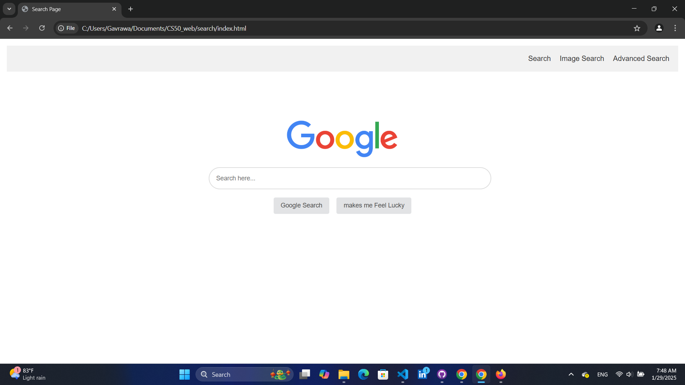
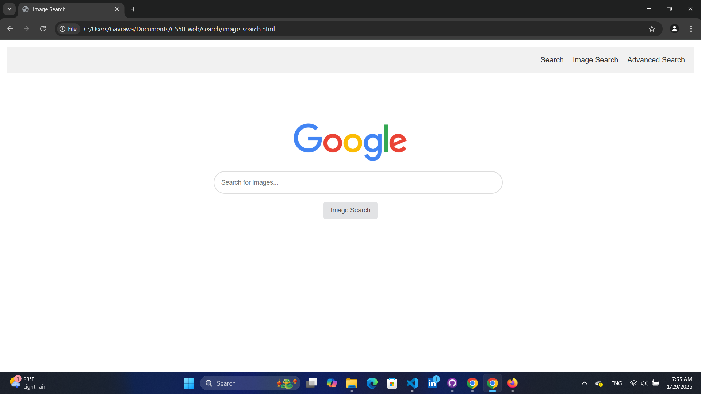
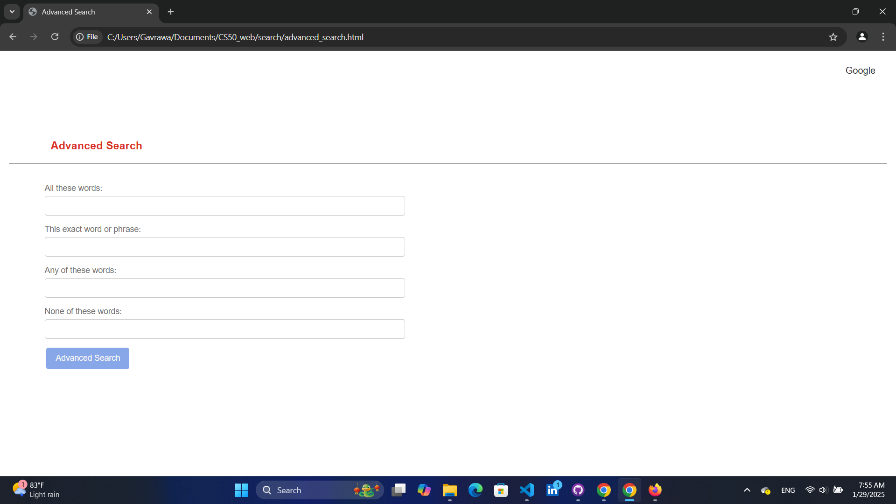

# google-search-bar
A simple Google-style search bar built using **HTML & CSS**. This project is part of **CS50 Problem Set 0** and serves as a beginner-friendly exercise in web development.  

## 🚀 Features  
✅ Google Search 
✅ Image Search
✅ Advanced Search

## 🖥️ Preview  
 |  | 

## 🛠️ Technologies Used  
- **HTML5**  
- **CSS3**  

## 📌 Usage  
1. Clone this repository:  
   ```sh
   git clone https://github.com/yourusername/google-search-bar.git
   cd google-search-bar
